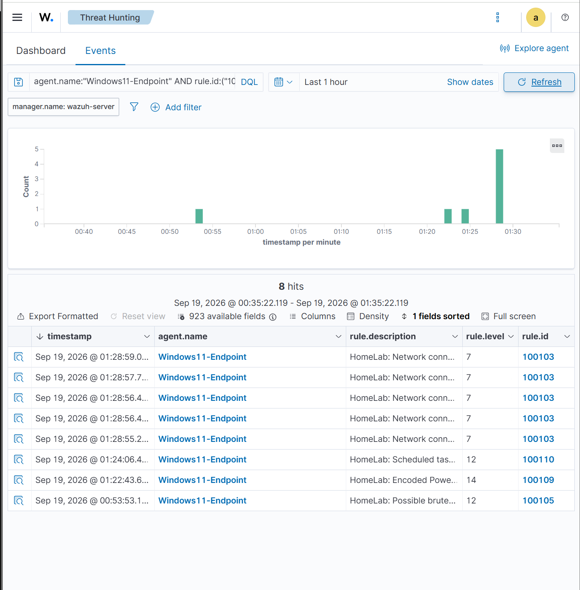
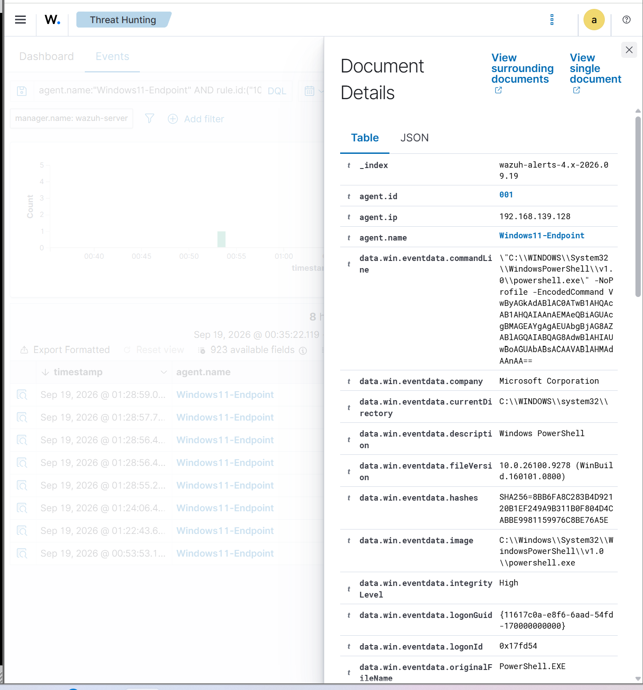
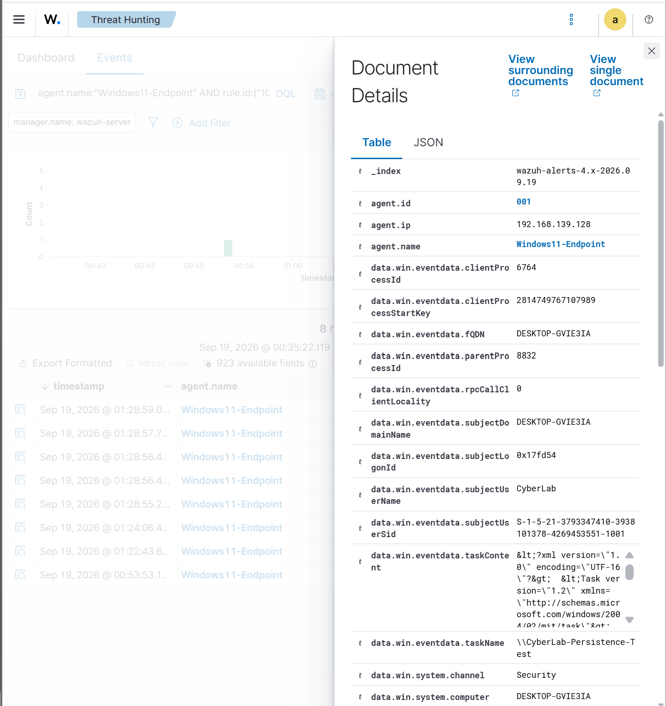
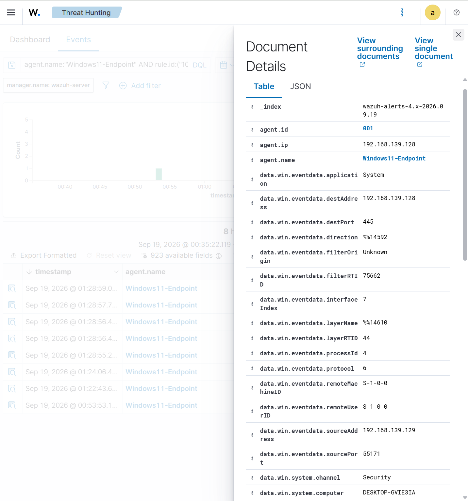
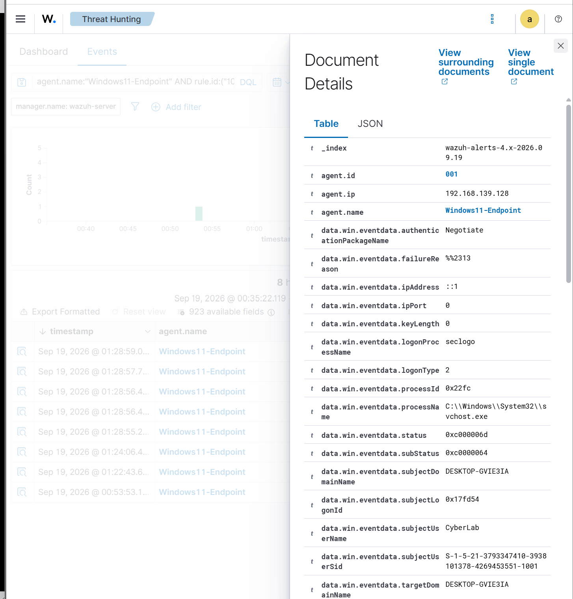
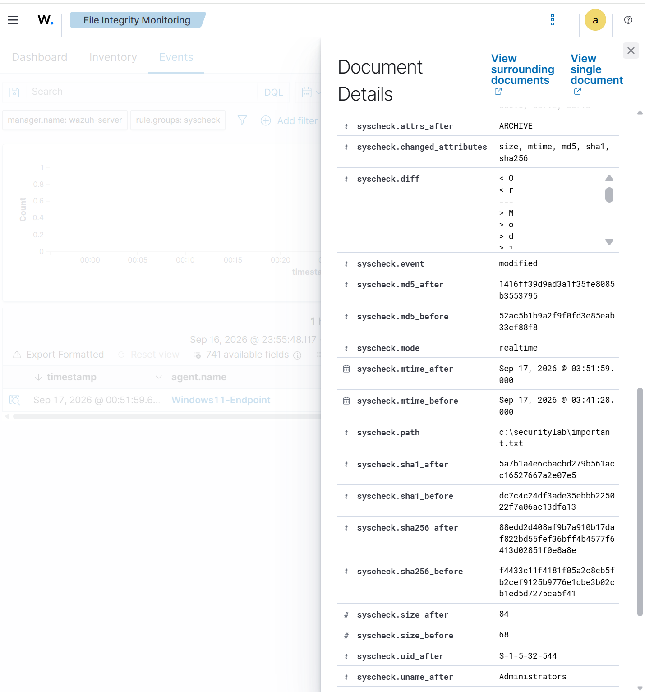

SOC home lab featuring Wazuh, Sysmon, Suricata, custom detection rules, attack simulation, and threat hunting.
# SOC Detection Engineering & Threat Hunting Home Lab

## Overview

This project is a multi-VM cybersecurity home lab designed to simulate security events, collect endpoint and network telemetry, develop custom detections, and investigate alerts in a SIEM environment.

The lab uses **Wazuh** for centralized security monitoring and detection, **Sysmon** for detailed Windows endpoint telemetry, **Suricata** for network intrusion detection, and **Kali Linux** for controlled attack simulation.

Throughout the project, I configured the environment, integrated multiple telemetry sources, developed and tested custom Wazuh detection rules, simulated adversary activity, and investigated the resulting alerts using Wazuh Threat Hunting.

---

## Architecture

### Lab Environment

| System | Role | IP Address |
|---|---|---|
| Kali Linux | Attack simulation / network monitoring | 192.168.139.129 |
| Windows 11 | Monitored endpoint | 192.168.139.128 |
| Ubuntu Server | Wazuh SIEM / Manager | 192.168.139.131 |

The lab operates on an isolated VMware network (`192.168.139.0/24`). Kali Linux also uses a separate NAT interface when Internet access is required.

---

## Technologies

- Wazuh
- Sysmon
- Suricata IDS
- Kali Linux
- Windows 11
- Ubuntu Server
- VMware Workstation
- PowerShell
- Nmap
- Windows Event Logging
- Microsoft Defender
- File Integrity Monitoring

---

## Detection Engineering

I developed and tested 11 custom Wazuh detection rules to identify endpoint and network security activity.

| Rule ID | Detection | Severity |
|---|---|---:|
| 100100 | Important Windows file modification | 12 |
| 100101 | `whoami.exe` execution / discovery activity | 5 |
| 100102 | PowerShell lab test activity | 7 |
| 100103 | Kali-originated network connection | 7 |
| 100104 | Possible network scan from Kali Linux | 10 |
| 100105 | Repeated failed logons / possible brute-force activity | 12 |
| 100106 | New Windows user account created | 10 |
| 100107 | User added to local Administrators group | 12 |
| 100108 | Microsoft Defender malware or PUP detection | 14 |
| 100109 | Encoded PowerShell / possible obfuscated execution | 14 |
| 100110 | Scheduled task creation / possible persistence | 12 |

These detections use telemetry from Sysmon, Windows Security events, Microsoft Defender, File Integrity Monitoring, and network activity.

---

## Endpoint Monitoring

Sysmon was deployed on the Windows 11 endpoint to provide detailed telemetry including:

- Process creation
- Command-line execution
- Process relationships
- Network activity
- File activity
- Cryptographic hashes

Windows Security logs and Microsoft Defender telemetry were also forwarded to Wazuh for centralized analysis.

File Integrity Monitoring was configured for security-sensitive files to detect modifications in real time.

---

## Network Monitoring

Suricata was deployed as the network IDS component of the lab.

Suricata telemetry was written to `eve.json` and forwarded through the Wazuh agent for centralized monitoring and analysis.

Network testing from Kali Linux was used to generate controlled traffic and validate network-oriented detections.

---

## Attack Simulation

Controlled security events were generated inside the isolated lab to validate detection coverage.

Examples include:

- Network reconnaissance and Nmap scanning
- Repeated authentication failures
- PowerShell execution
- Encoded PowerShell execution
- Scheduled-task creation
- Account creation
- Privileged-group modification
- File modification
- Network connections from the Kali attack system
- Discovery activity

The purpose of these simulations was not exploitation of external systems, but validation of logging, detection, alerting, and investigation workflows.

## Custom Detection Matrix

The lab includes 11 custom Wazuh rules designed to detect activity across endpoint, authentication, network, account-management, malware, persistence, and file-integrity telemetry.

| Rule ID | Detection | Level | Primary Telemetry | MITRE ATT&CK Mapping |
|---|---|---:|---|---|
| 100100 | Important Windows file modified | 12 | Wazuh FIM / Syscheck | Supporting telemetry — no direct technique assigned |
| 100101 | `whoami.exe` execution | 5 | Sysmon Process Creation | T1033 — System Owner/User Discovery |
| 100102 | PowerShell lab command execution | 7 | Sysmon / PowerShell process telemetry | T1059.001 — PowerShell |
| 100103 | Network connection originating from Kali Linux | 7 | Windows Filtering Platform | Supporting network telemetry |
| 100104 | Repeated Kali network connections / possible scan | 10 | Correlated network events | T1046 — Network Service Discovery |
| 100105 | Repeated failed authentication attempts | 12 | Windows Security authentication events | T1110 — Brute Force |
| 100106 | New Windows user account created | 10 | Windows Security Event 4720 | T1136.001 — Create Account: Local Account |
| 100107 | User added to local Administrators group | 12 | Windows Security Event 4732 | T1098 — Account Manipulation |
| 100108 | Microsoft Defender malware/PUP detection | 14 | Microsoft Defender | Supporting malware-detection telemetry |
| 100109 | Encoded PowerShell execution | 14 | Sysmon command-line telemetry | T1059.001 — PowerShell |
| 100110 | Windows scheduled task created | 12 | Windows Security telemetry | T1053.005 — Scheduled Task |

### Detection Engineering Approach

The rules use several detection strategies rather than relying on simple single-event matching:

- **Signature/field matching:** Detecting specific processes, command-line arguments, event IDs, file paths, and source addresses.
- **Behavioral correlation:** Rules 100104 and 100105 aggregate repeated activity within defined time windows to identify scanning and possible brute-force behavior.
- **High-value event monitoring:** Account creation, administrator-group changes, Defender detections, scheduled-task creation, and protected-file modifications are elevated for analyst review.
- **Context-aware detection:** Known lab infrastructure, including the Kali attack-simulation host, is incorporated into detection logic to distinguish controlled adversary activity.

MITRE ATT&CK mappings are applied only where the observed behavior directly supports a technique. Generic security telemetry such as a Defender alert, file modification, or individual network connection is retained as supporting telemetry rather than being assigned an unsupported ATT&CK technique.

## Threat Hunting & Investigation

Alerts were investigated using the Wazuh Threat Hunting interface.

Rather than relying only on alert names, I examined underlying event fields such as:

- Command lines
- Process names and IDs
- Parent processes
- User accounts
- Source and destination IP addresses
- Destination ports
- Event IDs
- File hashes
- Alert severity
- Detection rule IDs

This allowed activity to be traced from the original simulated action through endpoint or network telemetry and into the corresponding Wazuh alert.

## Detection & Investigation Evidence

The following examples demonstrate the end-to-end detection workflow used throughout the lab. Security activity was generated in the isolated environment, collected through endpoint or network telemetry, analyzed by Wazuh, and investigated through the Threat Hunting interface.

### Custom Detection Overview

Multiple custom detection rules were validated against activity generated in the lab. The Wazuh Threat Hunting dashboard shows alerts from several custom rules firing against the Windows 11 endpoint.

This view demonstrates multiple detection scenarios operating within the same monitoring environment, including network activity, authentication failures, encoded PowerShell, and scheduled-task creation.

---

### Encoded PowerShell Detection — Rule 100109

An encoded PowerShell command was executed on the Windows 11 endpoint to simulate suspicious or obfuscated command execution.

Sysmon captured the process execution and command-line telemetry. The event was forwarded to Wazuh, where custom **Rule 100109** detected the use of encoded PowerShell and generated a **Level 14** alert.

During investigation, the underlying event data was examined rather than relying only on the alert description. The command-line field exposed the PowerShell execution parameters, including the encoded-command behavior that triggered the detection.

**Detection flow:**

`PowerShell Execution → Sysmon Process Telemetry → Wazuh Agent → Rule 100109 → Level 14 Alert → Threat Hunting Investigation`

---

### Scheduled Task Persistence Detection — Rule 100110

A Windows scheduled task named `CyberLab-Persistence-Test` was created to simulate a persistence technique.

Wazuh detected the scheduled-task activity through custom **Rule 100110**, generating a **Level 12** alert.

The event was investigated through Wazuh to verify that the scheduled-task activity matched the controlled persistence simulation performed in the lab.

**Detection flow:**

`Scheduled Task Creation → Windows Telemetry → Wazuh → Rule 100110 → Level 12 Alert`

---

### Kali-to-Windows Network Detection

Kali Linux (`192.168.139.129`) was used as the attack-simulation system while Windows 11 (`192.168.139.128`) served as the monitored endpoint.

Controlled network reconnaissance and connection activity was generated from Kali and detected through the lab's network-monitoring and endpoint-telemetry pipeline.

Investigation of the event data provided visibility into source and destination addresses, ports, and connection information. This allowed activity originating from the attack VM to be correlated with alerts generated against the Windows endpoint.

---

### Brute-Force Authentication Detection — Rule 100105

Repeated Windows authentication failures were generated to test correlation-based detection.

Instead of treating a single failed login as a brute-force attack, custom **Rule 100105** correlates repeated authentication failures and generates a **Level 12** possible brute-force alert when the configured conditions are met.

The underlying Windows authentication telemetry was examined during investigation, providing additional information about the failed logon attempts and authentication behavior.

This test demonstrates the difference between detecting an individual event and correlating multiple related events into a higher-confidence security alert.

---

### File Integrity Monitoring — Rule 100100

Wazuh File Integrity Monitoring was configured to monitor security-sensitive files under:

`C:\SecurityLab`

A monitored file, `important.txt`, was modified to validate real-time integrity monitoring.

Wazuh recorded the modification in real time and identified changes to file metadata and cryptographic hashes, including **MD5, SHA-1, and SHA-256** values.

The investigation also confirmed that Wazuh's change-reporting functionality captured information about the modification. Custom **Rule 100100** was used to elevate modifications to the monitored file to a **Level 12** alert.

**Detection flow:**

`File Modified → Wazuh FIM → Integrity/Hash Comparison → Rule 100100 → Level 12 Alert → Investigation`

---

### What These Investigations Demonstrate

Together, these tests demonstrate several different detection strategies rather than relying on a single type of alert:

- Process and command-line analysis
- Suspicious PowerShell detection
- Persistence detection
- Network activity monitoring
- Authentication-event correlation
- File integrity monitoring
- Custom SIEM rule development
- Alert triage and investigation
- Endpoint and network telemetry analysis

The goal of the lab was not simply to generate alerts, but to understand the telemetry behind each detection and validate that the alert could be traced back to the activity that caused it.

## Example Detection Chain

One test involved executing an encoded PowerShell command on the Windows endpoint.

The activity produced Sysmon process-creation telemetry containing the PowerShell command line. The event was forwarded to Wazuh, where a custom rule identified the `-EncodedCommand` behavior and generated a high-severity alert.

This demonstrated the complete detection pipeline:

`Attack Simulation → Endpoint Telemetry → Wazuh Agent → Wazuh Manager → Custom Detection → Threat Hunting Investigation`

---

## Skills Demonstrated

- SIEM deployment and administration
- Detection engineering
- Custom Wazuh rule development
- Windows endpoint monitoring
- Sysmon configuration and analysis
- Network intrusion detection
- Suricata integration
- Log collection and analysis
- PowerShell telemetry analysis
- Threat hunting
- Alert triage
- Event correlation
- File integrity monitoring
- Attack simulation
- Security troubleshooting
- Virtualized network design

---

## Project Status

The core lab implementation and detection testing are complete.

Current work focuses on documenting investigations, mapping detections to MITRE ATT&CK, and developing portfolio-quality incident analysis.

---

## Disclaimer

All attack simulations and security testing documented in this project were performed in my own isolated lab environment for educational purposes.
